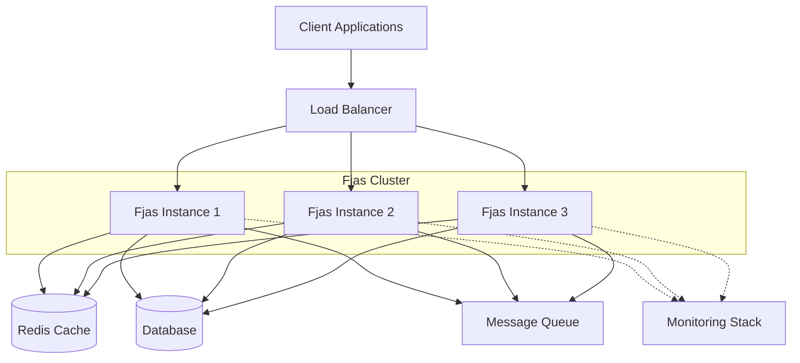

# Fjas - Fast JSON API Service 🚀

[](https://github.com)
[](https://github.com)
[](LICENSE)

**THIS IS WITH OBSIDIAN**

**Fjas** (Fast JSON API Service) is a next-generation, high-performance API gateway and data transformation engine designed for modern cloud-native applications. Built with speed, scalability, and ever glorious developer experience in mind.
**Fjas** (Fast JSON API Service) is a next-generation, high-performance API gateway and data transformation engine designed for modern cloud-native applications. Built with speed, scalability, and feverish but glorious developer experience in mind.

## 📋 Table of Contents

- [Features](#features)
- [Quick Start](#quick-start)
- [Documentation](#documentation)
- [Architecture](#architecture)
- [Use Cases](#use-cases)
- [Contributing](#contributing)
- [License](#license)

## ✨ Features

- **Blazing Fast** ⚡ - Sub-millisecond response times with intelligent caching
- **Schema Validation** ✅ - Built-in JSON Schema validation and transformation
- **Auto-scaling** 📈 - Kubernetes-native with horizontal pod autoscaling
- **Developer-Friendly** 💻 - Intuitive CLI, extensive documentation, and SDKs
- **Multi-Protocol** 🔌 - REST, GraphQL, gRPC, and WebSocket support
- **Observability** 👁️ - OpenTelemetry integration with distributed tracing

## 🚀 Quick Start

### Installation

```bash
# Using npm
npm install -g fjas

# Using Docker
docker pull fjas/fjas:latest

# Using Homebrew (macOS)
brew install fjas
```

### Basic Usage

```javascript
const Fjas = require('fjas');

// Initialize Fjas instance
const api = new Fjas({
  port: 3000,
  cache: {
    enabled: true,
    ttl: 300
  }
});

// Define a route
api.route('/users/:id', {
  method: 'GET',
  schema: {
    params: {
      type: 'object',
      properties: {
        id: { type: 'string', pattern: '^[0-9]+$' }
      }
    }
  },
  handler: async (req, res) => {
    const user = await db.users.findById(req.params.id);
    return res.json(user);
  }
});

// Start server
api.start();
```

### Configuration

```yaml
# fjas.config.yml
server:
  host: 0.0.0.0
  port: 3000
  workers: 4

cache:
  provider: redis
  host: localhost
  port: 6379
  ttl: 300

security:
  cors:
    enabled: true
    origins: ['*']
  rateLimit:
    enabled: true
    max: 100
    window: 60000
```

## 📚 Documentation

Comprehensive guides and reference documentation:

- **[Getting Started Guide](docs/getting-started.md)** - Step-by-step tutorial for beginners
- **[Architecture Overview](docs/architecture.md)** - System design and components
- **[API Reference](docs/api-reference.md)** - Complete API documentation
- **[Configuration Guide](docs/configuration.md)** - Advanced configuration options
- **[Performance Tuning](docs/performance.md)** - Optimization best practices
- **[Deployment Guide](docs/deployment.md)** - Production deployment strategies
- **[Troubleshooting](docs/troubleshooting.md)** - Common issues and solutions

## 🏗️ Architecture

Fjas follows a modular, microservices-ready architecture:



[Learn more about our architecture →](docs/architecture.md)

## 💡 Use Cases

### E-Commerce Platform
Handle millions of product catalog requests with intelligent caching and real-time inventory updates.

### IoT Data Ingestion
Process sensor data streams with schema validation and automatic data transformation.

### Microservices Gateway
Unified API gateway for microservices with service discovery and load balancing.

## 📊 Performance Benchmarks

| Metric | Value |
|--------|-------|
| Requests/sec | 45,000+ |
| Avg Latency | 0.8ms |
| P99 Latency | 12ms |
| Memory Usage | 128MB (base) |
| Cold Start | <100ms |

> **Note**: Benchmarks measured on AWS EC2 t3.medium instance with Redis cache enabled.

## 🛠️ Development

### Prerequisites

- Node.js 18+ or Go 1.20+
- Redis 6.0+
- Docker (optional)

### Building from Source

```bash
# Clone repository
git clone https://github.com/vismathomas/mkdocs-template.git
cd mkdocs-template

# Install dependencies
npm install

# Run tests
npm test

# Build
npm run build

# Run locally
npm run dev
```

### Running Tests

```bash
# Unit tests
npm test

# Integration tests
npm run test:integration

# E2E tests
npm run test:e2e

# Coverage
npm run test:coverage
```

## 🤝 Contributing

We welcome contributions! Please see our [Contributing Guide](CONTRIBUTING.md) for details.

### Development Workflow

1. Fork the repository
2. Create a feature branch (`git checkout -b feature/amazing-feature`)
3. Commit your changes (`git commit -m 'Add amazing feature'`)
4. Push to the branch (`git push origin feature/amazing-feature`)
5. Open a Pull Request

## 🌟 Community & Support

- [GitHub Discussions](https://github.com/vismathomas/mkdocs-template/discussions) - Ask questions and share ideas
- [Discord Server](https://discord.gg/fjas) - Real-time community chat
- [Stack Overflow](https://stackoverflow.com/questions/tagged/fjas) - Technical Q&A

## 📝 License

This project is licensed under the MIT License - see the [LICENSE](LICENSE) file for details.

## 🙏 Acknowledgments

- Built with ❤️ by the Fjas community
- Inspired by modern API gateway solutions
- Special thanks to all our [contributors](https://github.com/vismathomas/mkdocs-template/graphs/contributors)

---

**[Get Started Now](docs/getting-started.md)** | **[View Documentation](docs/)** | **[Join Community](https://discord.gg/fjas)**
