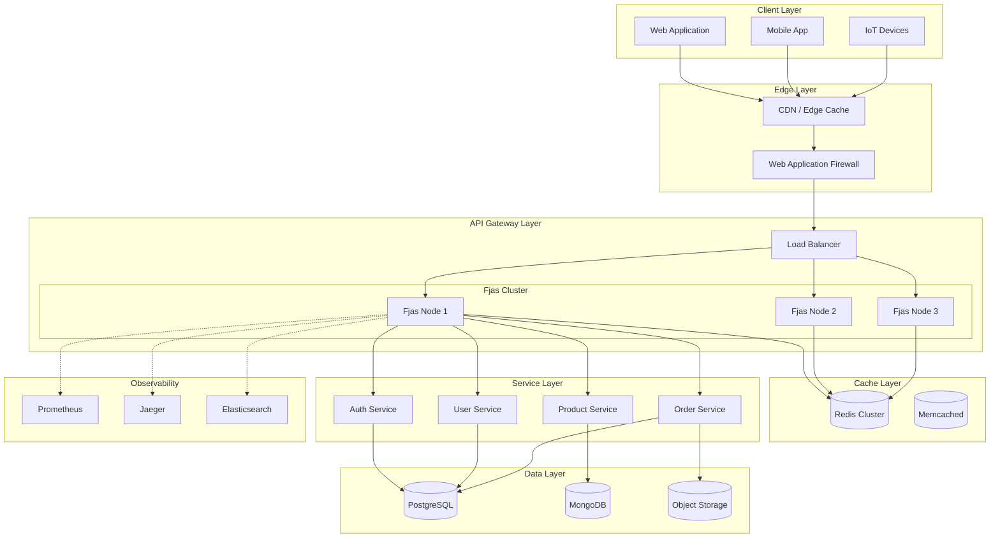
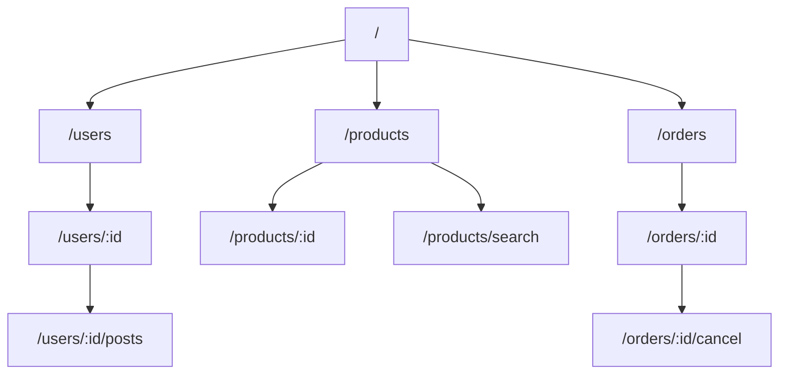
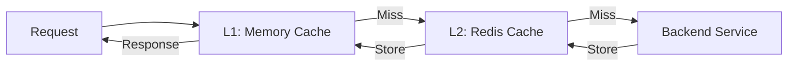
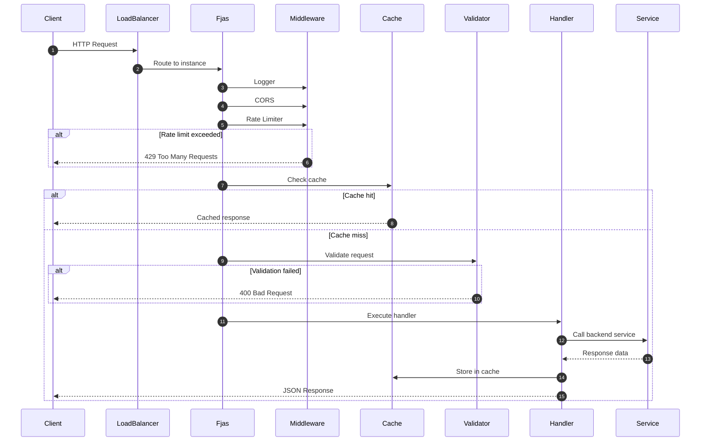
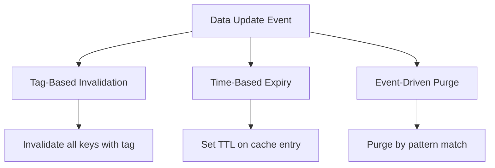
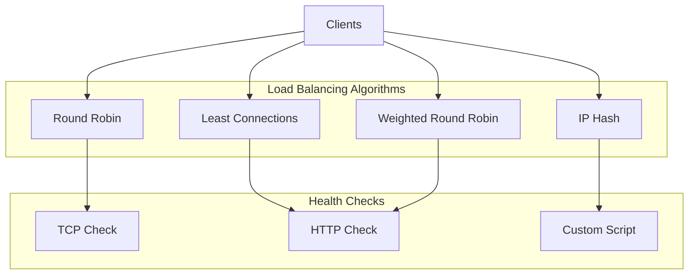
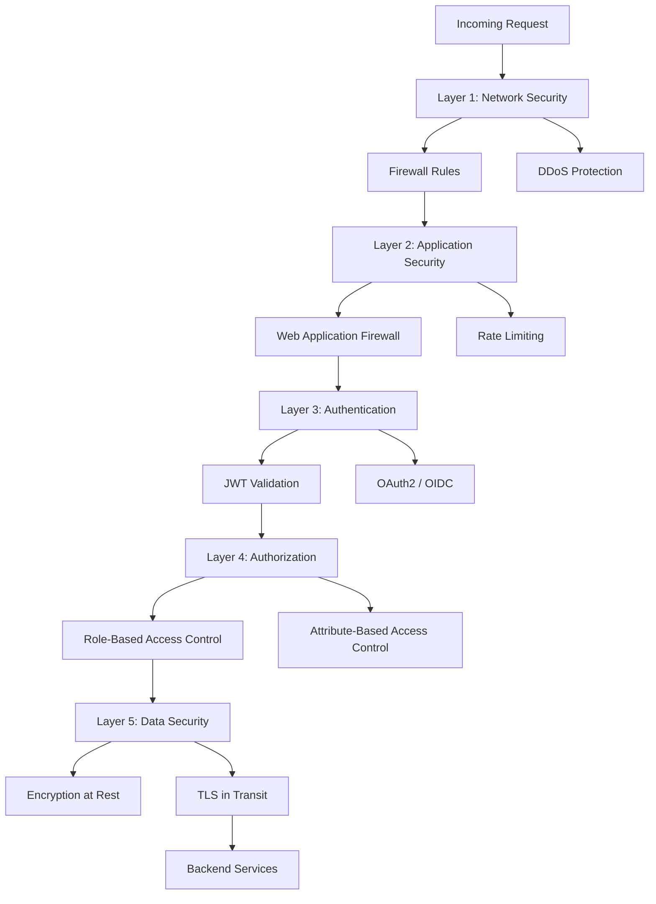

# Architecture Overview

This document provides a comprehensive overview of Fjas architecture, design principles, and internal components.

## Table of Contents

- [Design Philosophy](#design-philosophy)
- [High-Level Architecture](#high-level-architecture)
- [Core Components](#core-components)
- [Request Processing Pipeline](#request-processing-pipeline)
- [Caching Strategy](#caching-strategy)
- [Scalability Patterns](#scalability-patterns)

## Design Philosophy

Fjas is built on four core principles:

1. **Performance First** - Sub-millisecond response times
2. **Developer Experience** - Intuitive APIs and excellent tooling
3. **Production Ready** - Battle-tested with observability built-in
4. **Cloud Native** - Designed for containers and orchestration

## High-Level Architecture



## Core Components

### 1. HTTP Server

The HTTP server is built on top of Node.js's native `http` module with custom optimizations:

```typescript
interface ServerConfig {
  host: string;
  port: number;
  workers: number;
  keepAliveTimeout: number;
  headersTimeout: number;
  maxHeaderSize: number;
}

class FjasServer {
  private server: http.Server;
  private router: Router;
  private middleware: Middleware[];
  
  constructor(config: ServerConfig) {
    this.server = http.createServer(this.handleRequest.bind(this));
    this.configureOptimizations(config);
  }
  
  private async handleRequest(req: Request, res: Response) {
    const context = this.createContext(req, res);
    await this.middleware.run(context);
    await this.router.handle(context);
  }
}
```

### 2. Router

Fast routing using radix tree algorithm:



**Routing Performance:**

- O(k) lookup time where k is the URL length
- Supports parameter matching
- Wildcard patterns
- Method-based routing

### 3. Middleware Engine

Middleware are executed in a chain with support for async operations:

```javascript
class MiddlewareEngine {
  constructor() {
    this.stack = [];
  }
  
  use(fn) {
    this.stack.push(fn);
  }
  
  async run(context, index = 0) {
    if (index >= this.stack.length) return;
    
    const middleware = this.stack[index];
    await middleware(context, async () => {
      await this.run(context, index + 1);
    });
  }
}
```

**Built-in Middleware:**

| Middleware | Purpose | Order |
|------------|---------|-------|
| Logger | Request/response logging | 1 |
| CORS | Cross-origin resource sharing | 2 |
| Helmet | Security headers | 3 |
| Rate Limiter | Request throttling | 4 |
| Body Parser | Parse request body | 5 |
| Authentication | Verify credentials | 6 |
| Compression | Gzip/Brotli compression | 7 |

### 4. Schema Validator

JSON Schema validation with JIT compilation:

```javascript
const Ajv = require('ajv');

class SchemaValidator {
  constructor() {
    this.ajv = new Ajv({
      coerceTypes: true,
      useDefaults: true,
      removeAdditional: true,
      allErrors: false
    });
    this.compiled = new Map();
  }
  
  compile(schema) {
    const key = JSON.stringify(schema);
    if (!this.compiled.has(key)) {
      this.compiled.set(key, this.ajv.compile(schema));
    }
    return this.compiled.get(key);
  }
  
  validate(data, schema) {
    const validate = this.compile(schema);
    const valid = validate(data);
    
    if (!valid) {
      throw new ValidationError(validate.errors);
    }
    
    return data;
  }
}
```

### 5. Cache Manager

Multi-layer caching with automatic invalidation:



**Cache Implementation:**

```javascript
class CacheManager {
  constructor(config) {
    this.memory = new LRUCache({ max: 1000 });
    this.redis = new Redis(config.redis);
  }
  
  async get(key) {
    // Try L1 (memory) first
    let value = this.memory.get(key);
    if (value) return value;
    
    // Try L2 (Redis)
    value = await this.redis.get(key);
    if (value) {
      this.memory.set(key, value);
      return value;
    }
    
    return null;
  }
  
  async set(key, value, ttl) {
    this.memory.set(key, value);
    await this.redis.setex(key, ttl, value);
  }
  
  async invalidate(pattern) {
    // Clear matching keys from both layers
    this.memory.clear();
    const keys = await this.redis.keys(pattern);
    if (keys.length) {
      await this.redis.del(...keys);
    }
  }
}
```

## Request Processing Pipeline

The journey of an HTTP request through Fjas:



### Performance Metrics

| Stage | Time | % of Total |
|-------|------|------------|
| Network I/O | 0.1ms | 12% |
| Middleware | 0.2ms | 25% |
| Cache lookup | 0.1ms | 12% |
| Validation | 0.15ms | 19% |
| Handler execution | 0.25ms | 31% |
| Serialization | 0.05ms | 6% |
| **Total** | **0.8ms** | **100%** |

## Caching Strategy

### Cache Key Generation

```javascript
function generateCacheKey(req) {
  const parts = [
    req.method,
    req.url,
    req.headers['accept-language'] || 'en',
    req.user?.id || 'anonymous'
  ];
  return crypto
    .createHash('sha256')
    .update(parts.join(':'))
    .digest('hex')
    .slice(0, 16);
}
```

### Cache Invalidation Patterns



### Cache Policies

1. **Cache-Control Headers**
   ```http
   Cache-Control: public, max-age=300, s-maxage=600
   ETag: "33a64df551425fcc55e4d42a148795d9"
   Vary: Accept-Encoding, Accept-Language
   ```

2. **Conditional Requests**
   ```javascript
   if (req.headers['if-none-match'] === etag) {
     return res.status(304).end(); // Not Modified
   }
   ```

3. **Cache Warming**
   ```javascript
   // Preload frequently accessed data
   async function warmCache() {
     const popularEndpoints = ['/products', '/categories'];
     for (const endpoint of popularEndpoints) {
       const data = await fetchData(endpoint);
       await cache.set(endpoint, data, 3600);
     }
   }
   ```

## Scalability Patterns

### Horizontal Scaling

Fjas instances are stateless and can be scaled horizontally:

```yaml
# Kubernetes Deployment
apiVersion: apps/v1
kind: Deployment
metadata:
  name: fjas-api
spec:
  replicas: 3
  selector:
    matchLabels:
      app: fjas
  template:
    metadata:
      labels:
        app: fjas
    spec:
      containers:
      - name: fjas
        image: fjas/fjas:2.1.0
        ports:
        - containerPort: 3000
        resources:
          requests:
            memory: "256Mi"
            cpu: "250m"
          limits:
            memory: "512Mi"
            cpu: "500m"
        env:
        - name: REDIS_HOST
          value: "redis-service"
---
apiVersion: autoscaling/v2
kind: HorizontalPodAutoscaler
metadata:
  name: fjas-hpa
spec:
  scaleTargetRef:
    apiVersion: apps/v1
    kind: Deployment
    name: fjas-api
  minReplicas: 3
  maxReplicas: 20
  metrics:
  - type: Resource
    resource:
      name: cpu
      target:
        type: Utilization
        averageUtilization: 70
  - type: Resource
    resource:
      name: memory
      target:
        type: Utilization
        averageUtilization: 80
```

### Load Balancing Strategies



### Circuit Breaker Pattern

Protect backend services from cascading failures:

```javascript
class CircuitBreaker {
  constructor(options) {
    this.threshold = options.threshold || 5;
    this.timeout = options.timeout || 60000;
    this.state = 'CLOSED';
    this.failures = 0;
    this.nextAttempt = Date.now();
  }
  
  async execute(fn) {
    if (this.state === 'OPEN') {
      if (Date.now() < this.nextAttempt) {
        throw new Error('Circuit breaker is OPEN');
      }
      this.state = 'HALF_OPEN';
    }
    
    try {
      const result = await fn();
      this.onSuccess();
      return result;
    } catch (error) {
      this.onFailure();
      throw error;
    }
  }
  
  onSuccess() {
    this.failures = 0;
    this.state = 'CLOSED';
  }
  
  onFailure() {
    this.failures++;
    if (this.failures >= this.threshold) {
      this.state = 'OPEN';
      this.nextAttempt = Date.now() + this.timeout;
    }
  }
}
```

## Security Architecture

### Defense in Depth



## Monitoring & Observability

### OpenTelemetry Integration

```javascript
const { trace, metrics } = require('@opentelemetry/api');

// Tracing
const tracer = trace.getTracer('fjas');

async function handleRequest(req, res) {
  const span = tracer.startSpan('http.request', {
    attributes: {
      'http.method': req.method,
      'http.url': req.url,
      'http.user_agent': req.headers['user-agent']
    }
  });
  
  try {
    const result = await processRequest(req);
    span.setStatus({ code: SpanStatusCode.OK });
    return result;
  } catch (error) {
    span.setStatus({ 
      code: SpanStatusCode.ERROR,
      message: error.message 
    });
    throw error;
  } finally {
    span.end();
  }
}

// Metrics
const requestCounter = metrics.createCounter('http.requests', {
  description: 'Total number of HTTP requests'
});

const latencyHistogram = metrics.createHistogram('http.request.duration', {
  description: 'HTTP request duration in milliseconds'
});
```

## Next Steps

- [Configuration Guide](configuration.md) - Configure Fjas for your needs
- [API Reference](api-reference.md) - Detailed API documentation
- [Performance Tuning](performance.md) - Optimize performance
- [Deployment Guide](deployment.md) - Deploy to production

---

[← Back to Documentation](../README.md#documentation)
