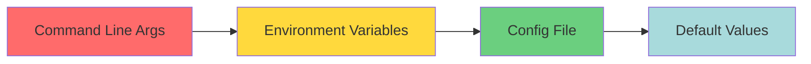
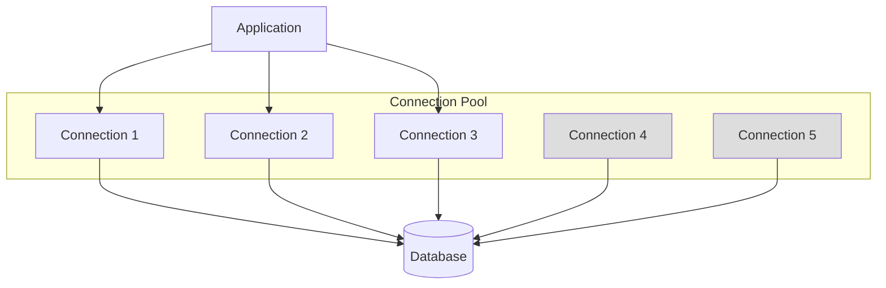

# Configuration Guide

Comprehensive guide to configuring Fjas for production environments.

## Configuration Methods

Fjas supports multiple configuration methods that can be combined:

1. **Configuration File** (`fjas.config.yml` or `fjas.config.json`)
2. **Environment Variables**
3. **Programmatic Configuration**
4. **Command Line Arguments**

### Priority Order



Higher priority sources override lower priority ones.

## Server Configuration

### Basic Server Options

```yaml
# fjas.config.yml
server:
  host: 0.0.0.0              # Bind address (default: 0.0.0.0)
  port: 3000                  # Server port (default: 3000)
  workers: 4                  # Number of worker processes (default: CPU count)
  keepAliveTimeout: 65000     # Keep-alive timeout in ms (default: 65000)
  headersTimeout: 66000       # Headers timeout in ms (default: 66000)
  maxHeaderSize: 16384        # Max header size in bytes (default: 16KB)
  requestTimeout: 30000       # Request timeout in ms (default: 30s)
```

### Worker Configuration

```yaml
server:
  workers: 4
  workerConfig:
    restartOnError: true      # Auto-restart failed workers
    maxRestarts: 5            # Max restart attempts
    restartDelay: 1000        # Delay between restarts (ms)
```

**Cluster Mode Example:**

```javascript
const Fjas = require('fjas');
const cluster = require('cluster');
const os = require('os');

if (cluster.isMaster) {
  const numWorkers = os.cpus().length;
  
  console.log(`Master process ${process.pid} starting ${numWorkers} workers`);
  
  for (let i = 0; i < numWorkers; i++) {
    cluster.fork();
  }
  
  cluster.on('exit', (worker, code, signal) => {
    console.log(`Worker ${worker.process.pid} died, restarting...`);
    cluster.fork();
  });
} else {
  const app = new Fjas();
  app.start();
  console.log(`Worker ${process.pid} started`);
}
```

## Cache Configuration

### In-Memory Cache

```yaml
cache:
  enabled: true
  provider: memory
  maxSize: 1000              # Max number of items
  ttl: 300                   # Default TTL in seconds
  checkPeriod: 60            # Check for expired items every N seconds
```

### Redis Cache

```yaml
cache:
  enabled: true
  provider: redis
  redis:
    host: localhost
    port: 6379
    password: ${REDIS_PASSWORD}
    db: 0
    keyPrefix: 'fjas:'
    connectTimeout: 10000
    maxRetriesPerRequest: 3
    enableReadyCheck: true
    enableOfflineQueue: true
  ttl: 300
```

### Redis Cluster

```yaml
cache:
  enabled: true
  provider: redis-cluster
  redisCluster:
    nodes:
      - host: redis-node-1
        port: 6379
      - host: redis-node-2
        port: 6379
      - host: redis-node-3
        port: 6379
    options:
      password: ${REDIS_PASSWORD}
      maxRedirections: 16
      retryDelayOnFailover: 100
```

### Multi-Layer Cache

```yaml
cache:
  enabled: true
  layers:
    - provider: memory
      maxSize: 500
      ttl: 60
    - provider: redis
      ttl: 300
    - provider: redis
      ttl: 3600
      keyPrefix: 'long-term:'
```

## Security Configuration

### CORS (Cross-Origin Resource Sharing)

```yaml
security:
  cors:
    enabled: true
    origins:
      - https://example.com
      - https://app.example.com
      - /^https:\/\/.*\.example\.com$/  # Regex pattern
    methods:
      - GET
      - POST
      - PUT
      - DELETE
      - PATCH
    allowedHeaders:
      - Content-Type
      - Authorization
      - X-Requested-With
    exposedHeaders:
      - X-Total-Count
      - X-Page-Count
    credentials: true
    maxAge: 86400              # Preflight cache duration (seconds)
    preflightContinue: false
```

### Helmet (Security Headers)

```yaml
security:
  helmet:
    enabled: true
    contentSecurityPolicy:
      directives:
        defaultSrc: ["'self'"]
        scriptSrc: ["'self'", "'unsafe-inline'"]
        styleSrc: ["'self'", "'unsafe-inline'"]
        imgSrc: ["'self'", "data:", "https:"]
    hsts:
      maxAge: 31536000
      includeSubDomains: true
      preload: true
    noSniff: true
    referrerPolicy:
      policy: 'strict-origin-when-cross-origin'
```

### Rate Limiting

```yaml
security:
  rateLimit:
    enabled: true
    global:
      max: 1000              # Max requests per window
      window: 60000          # Time window in ms (1 minute)
    endpoints:
      - path: /api/auth/login
        max: 5
        window: 300000       # 5 minutes
      - path: /api/search
        max: 100
        window: 60000
    keyGenerator: ip         # 'ip' or custom function
    skipSuccessfulRequests: false
    skipFailedRequests: false
    handler: default         # Custom handler for rate limit exceeded
```

### Authentication

#### JWT Configuration

```yaml
security:
  jwt:
    secret: ${JWT_SECRET}
    algorithm: HS256
    expiresIn: 3600          # 1 hour
    issuer: fjas-api
    audience: fjas-clients
    clockTolerance: 10       # Clock skew tolerance (seconds)
```

#### OAuth2 Configuration

```yaml
security:
  oauth2:
    providers:
      google:
        clientId: ${GOOGLE_CLIENT_ID}
        clientSecret: ${GOOGLE_CLIENT_SECRET}
        redirectUri: https://api.example.com/auth/google/callback
        scope:
          - openid
          - email
          - profile
      github:
        clientId: ${GITHUB_CLIENT_ID}
        clientSecret: ${GITHUB_CLIENT_SECRET}
        redirectUri: https://api.example.com/auth/github/callback
```

## Logging Configuration

### Basic Logging

```yaml
logging:
  level: info                # trace, debug, info, warn, error, fatal
  format: json               # json or pretty
  destination: stdout        # stdout, stderr, or file path
  timestamp: true
  colorize: false
```

### Advanced Logging

```yaml
logging:
  level: info
  format: json
  transports:
    - type: console
      level: debug
      format: pretty
      colorize: true
    - type: file
      level: info
      filename: logs/app.log
      maxSize: 10485760      # 10MB
      maxFiles: 5
      compress: true
    - type: rotating-file
      level: error
      filename: logs/error.log
      datePattern: YYYY-MM-DD
      maxFiles: 14d
  redact:
    paths:
      - 'req.headers.authorization'
      - 'req.body.password'
      - 'req.body.token'
    censor: '***REDACTED***'
```

### Log Levels

```javascript
const logger = require('fjas/logger');

logger.trace('Trace message');
logger.debug('Debug message');
logger.info('Info message');
logger.warn('Warning message');
logger.error('Error message');
logger.fatal('Fatal message');

// With context
logger.info({ userId: 123, action: 'login' }, 'User logged in');
```

## Database Configuration

### PostgreSQL

```yaml
database:
  postgres:
    host: localhost
    port: 5432
    database: myapp
    user: ${DB_USER}
    password: ${DB_PASSWORD}
    ssl: true
    pool:
      min: 2
      max: 10
      acquireTimeout: 30000
      idleTimeout: 10000
```

### MongoDB

```yaml
database:
  mongodb:
    url: mongodb://localhost:27017/myapp
    options:
      useNewUrlParser: true
      useUnifiedTopology: true
      maxPoolSize: 10
      minPoolSize: 2
      serverSelectionTimeoutMS: 5000
      socketTimeoutMS: 45000
```

### Connection Pooling



## Monitoring & Observability

### Metrics

```yaml
monitoring:
  metrics:
    enabled: true
    port: 9090
    path: /metrics
    format: prometheus
    defaultLabels:
      app: fjas-api
      env: ${NODE_ENV}
    collect:
      - http_requests_total
      - http_request_duration_seconds
      - http_request_size_bytes
      - http_response_size_bytes
      - process_cpu_usage
      - process_memory_usage
      - cache_hits_total
      - cache_misses_total
```

### Tracing (OpenTelemetry)

```yaml
monitoring:
  tracing:
    enabled: true
    serviceName: fjas-api
    serviceVersion: 2.1.0
    exporter: otlp
    endpoint: http://localhost:4318
    headers:
      x-api-key: ${TELEMETRY_API_KEY}
    sampleRate: 1.0          # Sample 100% of traces
    attributes:
      deployment.environment: ${NODE_ENV}
      service.namespace: production
```

### Health Checks

```yaml
monitoring:
  health:
    enabled: true
    path: /health
    checks:
      - name: database
        type: postgres
        timeout: 5000
      - name: redis
        type: redis
        timeout: 2000
      - name: external-api
        type: http
        url: https://api.external.com/health
        timeout: 3000
```

**Health Check Response:**

```json
{
  "status": "healthy",
  "timestamp": "2025-10-16T12:00:00.000Z",
  "uptime": 3600,
  "checks": {
    "database": {
      "status": "healthy",
      "responseTime": 5
    },
    "redis": {
      "status": "healthy",
      "responseTime": 2
    },
    "external-api": {
      "status": "degraded",
      "responseTime": 3500
    }
  }
}
```

## Performance Tuning

### Compression

```yaml
performance:
  compression:
    enabled: true
    level: 6                 # 0-9 (higher = more compression, slower)
    threshold: 1024          # Min bytes to compress
    types:
      - text/html
      - text/css
      - text/javascript
      - application/json
      - application/xml
```

### HTTP/2

```yaml
server:
  http2:
    enabled: true
    allowHTTP1: true         # Fallback to HTTP/1.1
    maxConcurrentStreams: 100
    initialWindowSize: 65535
```

### Keep-Alive

```yaml
server:
  keepAlive:
    enabled: true
    timeout: 65000           # ms
    maxRequests: 100         # Max requests per connection
```

### Request Body Limits

```yaml
server:
  bodyParser:
    json:
      limit: 1mb
      strict: true
    urlencoded:
      limit: 1mb
      extended: true
    raw:
      limit: 5mb
    multipart:
      limit: 50mb
```

## Environment-Specific Configuration

### Development

```yaml
# fjas.dev.yml
server:
  port: 3000
  workers: 1

logging:
  level: debug
  format: pretty
  colorize: true

cache:
  enabled: false

security:
  cors:
    origins: ['*']
```

### Production

```yaml
# fjas.prod.yml
server:
  port: ${PORT}
  workers: ${WORKERS}
  keepAliveTimeout: 65000

logging:
  level: info
  format: json
  destination: /var/log/fjas/app.log

cache:
  enabled: true
  provider: redis-cluster

security:
  cors:
    origins:
      - https://example.com
  helmet:
    enabled: true
  rateLimit:
    enabled: true
```

### Loading Configuration

```bash
# Development
fjas start --config fjas.dev.yml

# Production
NODE_ENV=production fjas start --config fjas.prod.yml
```

## Configuration Validation

Fjas validates configuration on startup:

```javascript
const { validateConfig } = require('fjas/config');

try {
  const config = validateConfig({
    server: { port: 3000 },
    cache: { enabled: true }
  });
  console.log('Configuration valid');
} catch (error) {
  console.error('Invalid configuration:', error.message);
  process.exit(1);
}
```

## Next Steps

- [Performance Tuning](performance.md) - Optimize your application
- [Deployment Guide](deployment.md) - Deploy to production
- [API Reference](api-reference.md) - Complete API documentation

---

[← Back to Documentation](../README.md#documentation)
