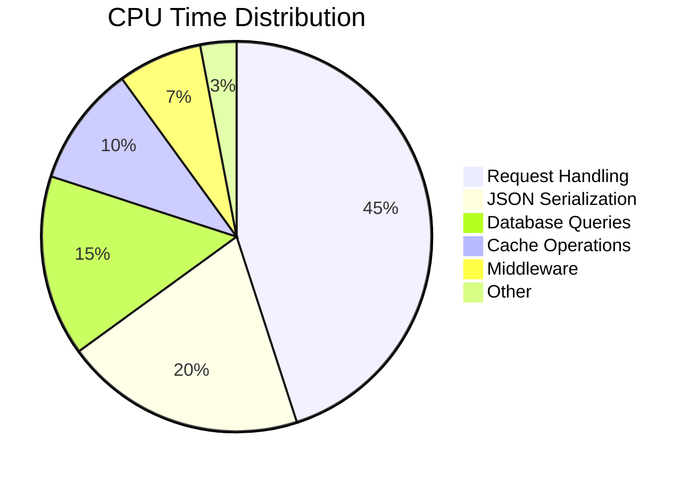
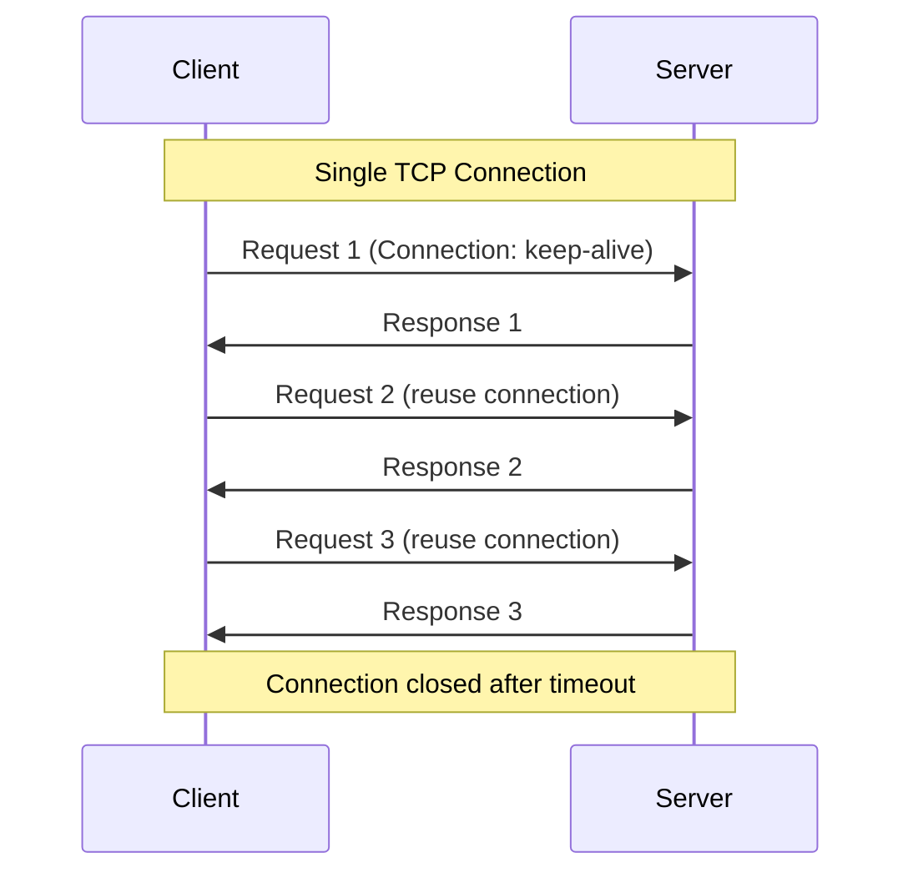
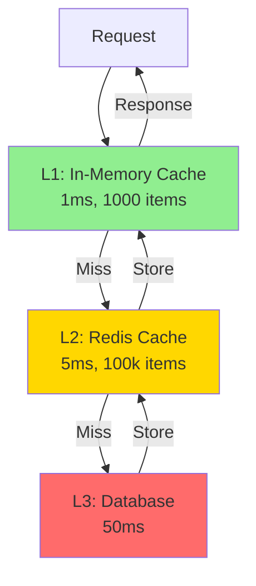

# Performance Tuning Guide

Optimize Fjas for maximum performance and efficiency.

## Table of Contents

- [Benchmarking](#benchmarking)
- [CPU Optimization](#cpu-optimization)
- [Memory Optimization](#memory-optimization)
- [Network Optimization](#network-optimization)
- [Database Optimization](#database-optimization)
- [Caching Strategies](#caching-strategies)
- [Load Testing](#load-testing)

## Benchmarking

### Baseline Performance

Before optimizing, establish baseline metrics:

```bash
# Install benchmarking tool
npm install -g autocannon

# Run benchmark
autocannon -c 100 -d 30 http://localhost:3000/api/users
```

**Sample Output:**

```
Running 30s test @ http://localhost:3000/api/users
100 connections

┌─────────┬──────┬──────┬────────┬────────┬─────────┬─────────┬────────┐
│ Stat    │ 2.5% │ 50%  │ 97.5%  │ 99%    │ Avg     │ Stdev   │ Max    │
├─────────┼──────┼──────┼────────┼────────┼─────────┼─────────┼────────┤
│ Latency │ 0 ms │ 0 ms │ 2 ms   │ 5 ms   │ 0.8 ms  │ 1.2 ms  │ 45 ms  │
└─────────┴──────┴──────┴────────┴────────┴─────────┴─────────┴────────┘
┌───────────┬─────────┬─────────┬─────────┬─────────┬─────────┬─────────┬─────────┐
│ Stat      │ 1%      │ 2.5%    │ 50%     │ 97.5%   │ Avg     │ Stdev   │ Min     │
├───────────┼─────────┼─────────┼─────────┼─────────┼─────────┼─────────┼─────────┤
│ Req/Sec   │ 43,000  │ 43,000  │ 45,000  │ 46,000  │ 44,800  │ 800     │ 43,000  │
└───────────┴─────────┴─────────┴─────────┴─────────┴─────────┴─────────┴─────────┘

1.3M requests in 30s, 300 MB read
```

### Performance Goals

| Metric | Target | Excellent |
|--------|--------|-----------|
| Requests/sec | 10,000+ | 50,000+ |
| Avg Latency | <10ms | <2ms |
| P99 Latency | <50ms | <20ms |
| Memory | <500MB | <256MB |
| CPU Usage | <70% | <50% |

## CPU Optimization

### Worker Processes

Use cluster mode to utilize all CPU cores:

```javascript
const Fjas = require('fjas');
const cluster = require('cluster');
const os = require('os');

const numCPUs = os.cpus().length;

if (cluster.isMaster) {
  console.log(`Master ${process.pid} starting ${numCPUs} workers`);
  
  for (let i = 0; i < numCPUs; i++) {
    cluster.fork();
  }
  
  cluster.on('exit', (worker) => {
    console.log(`Worker ${worker.process.pid} died, restarting...`);
    cluster.fork();
  }); 
} else {
  const app = new Fjas({ port: 3000 });
  app.start();
  console.log(`Worker ${process.pid} started`);
}
```

### CPU Affinity

Pin workers to specific CPU cores (Linux):

```javascript
const taskset = require('taskset');

if (cluster.isWorker) {
  const cpuId = cluster.worker.id % os.cpus().length;
  taskset.setCpuAffinity(process.pid, [cpuId]);
}
```

### Profiling CPU

```bash
# Node.js built-in profiler
node --prof app.js

# Generate readable output
node --prof-process isolate-*.log > profile.txt

# Use clinic.js for detailed profiling
npm install -g clinic
clinic doctor -- node app.js
```

**CPU Profile Visualization:**



## Memory Optimization

### Memory Profiling

```bash
# Heap snapshot
node --inspect app.js
# Then connect Chrome DevTools to take heap snapshots

# Memory leak detection
npm install -g clinic
clinic heapprofiler -- node app.js
```

### Memory Limits

```javascript
// Set memory limits
node --max-old-space-size=2048 app.js  // 2GB heap

// Monitor memory usage
const v8 = require('v8');
const heapStats = v8.getHeapStatistics();

console.log({
  totalHeap: (heapStats.total_heap_size / 1024 / 1024).toFixed(2) + ' MB',
  usedHeap: (heapStats.used_heap_size / 1024 / 1024).toFixed(2) + ' MB',
  heapLimit: (heapStats.heap_size_limit / 1024 / 1024).toFixed(2) + ' MB'
});
```

### Garbage Collection Tuning

```bash
# Optimize GC for throughput
node --max-old-space-size=2048 --gc-global app.js

# Optimize GC for latency
node --max-old-space-size=2048 --optimize-for-size app.js

# Expose GC metrics
node --expose-gc app.js
```

### Object Pooling

Reuse objects to reduce GC pressure:

```javascript
class ObjectPool {
  constructor(factory, reset, size = 100) {
    this.factory = factory;
    this.reset = reset;
    this.pool = [];
    
    for (let i = 0; i < size; i++) {
      this.pool.push(factory());
    }
  }
  
  acquire() {
    if (this.pool.length > 0) {
      return this.pool.pop();
    }
    return this.factory();
  }
  
  release(obj) {
    this.reset(obj);
    this.pool.push(obj);
  }
}

// Usage: Response object pool
const responsePool = new ObjectPool(
  () => ({ statusCode: 200, headers: {}, body: null }),
  (obj) => {
    obj.statusCode = 200;
    obj.headers = {};
    obj.body = null;
  }
);

const response = responsePool.acquire();
// Use response...
responsePool.release(response);
```

## Network Optimization

### HTTP Keep-Alive

Enable persistent connections:

```yaml
server:
  keepAlive:
    enabled: true
    timeout: 65000
    maxRequests: 100
```

**Connection Flow:**



### Compression

Enable response compression:

```yaml
performance:
  compression:
    enabled: true
    level: 6                  # Balance between speed and ratio
    threshold: 1024           # Only compress responses > 1KB
    brotli:
      enabled: true
      quality: 4
```

**Compression Comparison:**

| Method | Ratio | Speed | CPU Usage |
|--------|-------|-------|-----------|
| None | 1.0x | Fastest | Lowest |
| Gzip (level 1) | 2.5x | Fast | Low |
| Gzip (level 6) | 3.2x | Medium | Medium |
| Gzip (level 9) | 3.5x | Slow | High |
| Brotli (quality 4) | 3.8x | Medium | Medium |
| Brotli (quality 11) | 4.2x | Very Slow | Very High |

### Connection Pooling

Reuse connections to backend services:

```javascript
const http = require('http');

const agent = new http.Agent({
  keepAlive: true,
  keepAliveMsecs: 1000,
  maxSockets: 50,
  maxFreeSockets: 10,
  timeout: 60000
});

// Use agent for requests
const options = {
  hostname: 'api.backend.com',
  port: 80,
  path: '/data',
  agent: agent
};
```

## Database Optimization

### Connection Pooling

```javascript
const { Pool } = require('pg');

const pool = new Pool({
  host: 'localhost',
  database: 'myapp',
  max: 20,                    // Maximum pool size
  min: 5,                     // Minimum pool size
  idleTimeoutMillis: 30000,   // Close idle connections after 30s
  connectionTimeoutMillis: 2000 // Wait 2s for connection
});

// Prepared statements
const queryPlan = {
  name: 'get-user',
  text: 'SELECT * FROM users WHERE id = $1',
  values: [userId]
};

const result = await pool.query(queryPlan);
```

### Query Optimization

```javascript
// Bad: N+1 queries
async function getBadUsers() {
  const users = await db.query('SELECT * FROM users');
  for (const user of users) {
    user.posts = await db.query('SELECT * FROM posts WHERE user_id = $1', [user.id]);
  }
  return users;
}

// Good: Single JOIN query
async function getGoodUsers() {
  return await db.query(`
    SELECT 
      u.*,
      json_agg(p.*) as posts
    FROM users u
    LEFT JOIN posts p ON p.user_id = u.id
    GROUP BY u.id
  `);
}
```

### Indexing Strategy

```sql
-- Add indexes on frequently queried columns
CREATE INDEX idx_users_email ON users(email);
CREATE INDEX idx_posts_user_id ON posts(user_id);
CREATE INDEX idx_posts_created_at ON posts(created_at DESC);

-- Composite indexes for common query patterns
CREATE INDEX idx_posts_user_date ON posts(user_id, created_at DESC);

-- Partial indexes for filtered queries
CREATE INDEX idx_active_users ON users(id) WHERE active = true;

-- Analyze index usage
SELECT 
  schemaname,
  tablename,
  indexname,
  idx_scan as scans,
  idx_tup_read as tuples_read,
  idx_tup_fetch as tuples_fetched
FROM pg_stat_user_indexes
WHERE idx_scan = 0
ORDER BY pg_relation_size(indexrelid) DESC;
```

## Caching Strategies

### Cache Hierarchy



### Cache Warming

Preload frequently accessed data:

```javascript
async function warmCache() {
  const popularItems = await db.query(`
    SELECT id FROM products 
    ORDER BY views DESC 
    LIMIT 100
  `);
  
  for (const item of popularItems) {
    const data = await db.query('SELECT * FROM products WHERE id = $1', [item.id]);
    await cache.set(`product:${item.id}`, data, 3600);
  }
  
  console.log('Cache warmed with 100 popular products');
}

// Warm cache on startup
app.on('ready', warmCache);

// Periodic refresh
setInterval(warmCache, 3600000); // Every hour
```

### Cache Invalidation

```javascript
class CacheManager {
  constructor(redis) {
    this.redis = redis;
    this.tags = new Map();
  }
  
  async set(key, value, ttl, tags = []) {
    await this.redis.setex(key, ttl, JSON.stringify(value));
    
    // Store tag mappings
    for (const tag of tags) {
      await this.redis.sadd(`tag:${tag}`, key);
    }
  }
  
  async invalidateTag(tag) {
    const keys = await this.redis.smembers(`tag:${tag}`);
    if (keys.length > 0) {
      await this.redis.del(...keys);
      await this.redis.del(`tag:${tag}`);
    }
  }
}

// Usage
await cache.set('product:123', product, 3600, ['products', 'electronics']);

// Invalidate all electronics products
await cache.invalidateTag('electronics');
```

### Cache Patterns

**Read-Through:**
```javascript
async function getUser(id) {
  const cached = await cache.get(`user:${id}`);
  if (cached) return cached;
  
  const user = await db.users.findById(id);
  await cache.set(`user:${id}`, user, 300);
  return user;
}
```

**Write-Through:**
```javascript
async function updateUser(id, data) {
  const user = await db.users.update(id, data);
  await cache.set(`user:${id}`, user, 300);
  return user;
}
```

**Write-Behind:**
```javascript
const writeQueue = [];

async function updateUser(id, data) {
  await cache.set(`user:${id}`, data, 300);
  writeQueue.push({ id, data });
  return data;
}

// Flush queue periodically
setInterval(async () => {
  const batch = writeQueue.splice(0, 100);
  await db.users.bulkUpdate(batch);
}, 5000);
```

## Load Testing

### Test Scenarios

```javascript
// autocannon-test.js
const autocannon = require('autocannon');

const tests = [
  {
    name: 'GET /api/users',
    url: 'http://localhost:3000/api/users',
    connections: 100,
    duration: 30
  },
  {
    name: 'POST /api/users',
    url: 'http://localhost:3000/api/users',
    method: 'POST',
    headers: { 'content-type': 'application/json' },
    body: JSON.stringify({ name: 'Test User', email: 'test@example.com' }),
    connections: 50,
    duration: 30
  }
];

async function runTests() {
  for (const test of tests) {
    console.log(`\nRunning test: ${test.name}`);
    const result = await autocannon(test);
    console.log(autocannon.printResult(result));
  }
}

runTests();
```

### Stress Testing

Gradually increase load to find breaking point:

```bash
# k6 load testing
npm install -g k6

# Create test script
cat > stress-test.js << 'EOF'
import http from 'k6/http';
import { check, sleep } from 'k6';

export let options = {
  stages: [
    { duration: '2m', target: 100 },   // Ramp up to 100 users
    { duration: '5m', target: 100 },   // Stay at 100 users
    { duration: '2m', target: 200 },   // Ramp up to 200 users
    { duration: '5m', target: 200 },   // Stay at 200 users
    { duration: '2m', target: 500 },   // Spike to 500 users
    { duration: '5m', target: 500 },   // Stay at 500 users
    { duration: '2m', target: 0 },     // Ramp down to 0 users
  ],
};

export default function() {
  let response = http.get('http://localhost:3000/api/users');
  check(response, {
    'status is 200': (r) => r.status === 200,
    'response time < 500ms': (r) => r.timings.duration < 500,
  });
  sleep(1);
}
EOF

# Run test
k6 run stress-test.js
```

### Performance Monitoring

```javascript
const prometheus = require('prom-client');

// Register metrics
const httpRequestDuration = new prometheus.Histogram({
  name: 'http_request_duration_seconds',
  help: 'Duration of HTTP requests in seconds',
  labelNames: ['method', 'route', 'status'],
  buckets: [0.001, 0.005, 0.01, 0.05, 0.1, 0.5, 1, 5]
});

const httpRequestTotal = new prometheus.Counter({
  name: 'http_requests_total',
  help: 'Total number of HTTP requests',
  labelNames: ['method', 'route', 'status']
});

// Middleware to collect metrics
app.use(async (req, res, next) => {
  const start = Date.now();
  
  await next();
  
  const duration = (Date.now() - start) / 1000;
  const labels = {
    method: req.method,
    route: req.route?.path || req.path,
    status: res.statusCode
  };
  
  httpRequestDuration.observe(labels, duration);
  httpRequestTotal.inc(labels);
});

// Expose metrics endpoint
app.get('/metrics', async (req, res) => {
  res.set('Content-Type', prometheus.register.contentType);
  res.send(await prometheus.register.metrics());
});
```

## Best Practices Summary

### Do's ✅

- ✅ Use worker processes to utilize all CPU cores
- ✅ Enable HTTP keep-alive and compression
- ✅ Implement multi-layer caching
- ✅ Use connection pooling for databases
- ✅ Profile and benchmark regularly
- ✅ Monitor metrics in production
- ✅ Set appropriate timeouts
- ✅ Use prepared statements for queries

### Don'ts ❌

- ❌ Don't block the event loop with CPU-intensive tasks
- ❌ Don't cache everything (be selective)
- ❌ Don't use synchronous operations in handlers
- ❌ Don't ignore memory leaks
- ❌ Don't skip load testing
- ❌ Don't over-optimize prematurely
- ❌ Don't forget to set resource limits
- ❌ Don't neglect monitoring

## Next Steps

- [Deployment Guide](deployment.md) - Deploy optimized application
- [Troubleshooting](troubleshooting.md) - Debug performance issues
- [Architecture](architecture.md) - Understand system design

---

[← Back to Documentation](../README.md#documentation)
