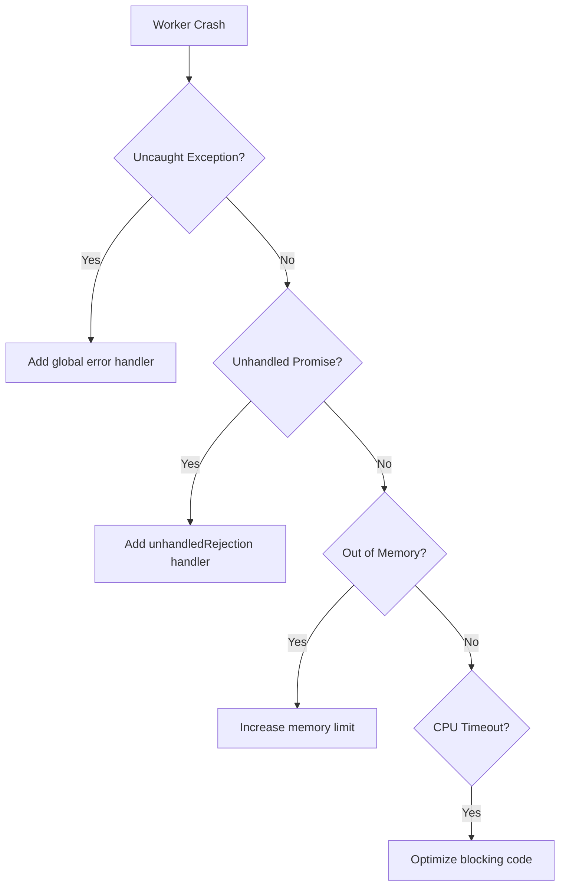
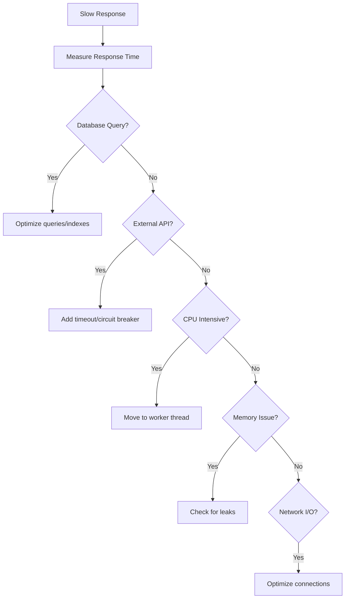
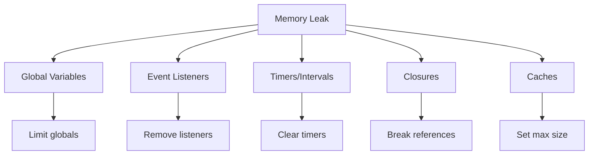

# Troubleshooting Guide

Common issues and solutions for Fjas applications.

## Table of Contents

- [Server Issues](#server-issues)
- [Performance Problems](#performance-problems)
- [Cache Issues](#cache-issues)
- [Database Connection Issues](#database-connection-issues)
- [Memory Leaks](#memory-leaks)
- [Debugging Tools](#debugging-tools)

## Server Issues

### Port Already in Use

**Problem:** Server fails to start with error `EADDRINUSE`

```
Error: listen EADDRINUSE: address already in use 0.0.0.0:3000
```

**Solutions:**

```bash
# Windows - Find process using port
netstat -ano | findstr :3000
taskkill /PID <process_id> /F

# Linux/macOS - Find and kill process
lsof -ti:3000 | xargs kill -9

# Or use different port
export FJAS_PORT=3001
fjas start
```

**Programmatic check:**

```javascript
const net = require('net');

function isPortAvailable(port) {
  return new Promise((resolve) => {
    const server = net.createServer();
    server.once('error', (err) => {
      resolve(false);
    });
    server.once('listening', () => {
      server.close();
      resolve(true);
    });
    server.listen(port);
  });
}

async function startServer() {
  let port = 3000;
  while (!(await isPortAvailable(port))) {
    port++;
  }
  app.listen(port);
  console.log(`Server started on port ${port}`);
}
```

### Worker Process Crashes

**Problem:** Worker processes crash unexpectedly

**Diagnosis:**

```javascript
const cluster = require('cluster');

if (cluster.isMaster) {
  cluster.on('exit', (worker, code, signal) => {
    console.error(`Worker ${worker.process.pid} died`, {
      code,
      signal,
      exitedAfterDisconnect: worker.exitedAfterDisconnect
    });
    
    // Restart worker
    if (!worker.exitedAfterDisconnect) {
      console.log('Restarting worker...');
      cluster.fork();
    }
  });
  
  cluster.on('disconnect', (worker) => {
    console.log(`Worker ${worker.process.pid} disconnected`);
  });
}
```

**Common causes:**



**Solutions:**

```javascript
// Global error handlers
process.on('uncaughtException', (error) => {
  console.error('Uncaught Exception:', error);
  // Log error, cleanup, and exit gracefully
  gracefulShutdown();
});

process.on('unhandledRejection', (reason, promise) => {
  console.error('Unhandled Rejection at:', promise, 'reason:', reason);
  // Log and handle
});

// Graceful shutdown
function gracefulShutdown() {
  console.log('Starting graceful shutdown...');
  
  server.close(() => {
    console.log('Server closed');
    
    // Close database connections
    db.close(() => {
      console.log('Database connection closed');
      process.exit(1);
    });
  });
  
  // Force exit after 30 seconds
  setTimeout(() => {
    console.error('Forced shutdown');
    process.exit(1);
  }, 30000);
}
```

## Performance Problems

### Slow Response Times

**Diagnosis flow:**



**Profiling tool:**

```javascript
const { performance } = require('perf_hooks');

class PerformanceMonitor {
  constructor() {
    this.measurements = new Map();
  }
  
  start(label) {
    this.measurements.set(label, performance.now());
  }
  
  end(label) {
    const start = this.measurements.get(label);
    if (start) {
      const duration = performance.now() - start;
      console.log(`[${label}] took ${duration.toFixed(2)}ms`);
      this.measurements.delete(label);
      return duration;
    }
  }
  
  async measure(label, fn) {
    this.start(label);
    try {
      const result = await fn();
      return result;
    } finally {
      this.end(label);
    }
  }
}

// Usage
const monitor = new PerformanceMonitor();

router.get('/users/:id', async (req, res) => {
  const user = await monitor.measure('db-query', async () => {
    return await User.findById(req.params.id);
  });
  
  const posts = await monitor.measure('get-posts', async () => {
    return await Post.findByUserId(user.id);
  });
  
  res.json({ user, posts });
});
```

### High CPU Usage

**Check CPU usage:**

```javascript
const os = require('os');

function getCPUUsage() {
  const cpus = os.cpus();
  let totalIdle = 0;
  let totalTick = 0;
  
  cpus.forEach((cpu) => {
    for (const type in cpu.times) {
      totalTick += cpu.times[type];
    }
    totalIdle += cpu.times.idle;
  });
  
  const idle = totalIdle / cpus.length;
  const total = totalTick / cpus.length;
  const usage = 100 - ~~(100 * idle / total);
  
  return {
    usage: `${usage}%`,
    cores: cpus.length,
    model: cpus[0].model
  };
}

// Monitor CPU every 5 seconds
setInterval(() => {
  const cpu = getCPUUsage();
  if (parseInt(cpu.usage) > 80) {
    console.warn('High CPU usage detected:', cpu);
  }
}, 5000);
```

**Identify CPU bottlenecks:**

```bash
# Profile CPU usage
node --prof app.js

# Process profile log
node --prof-process isolate-*.log > profile.txt

# Look for hot functions
grep -A 5 "ticks" profile.txt
```

## Cache Issues

### Cache Miss Rate Too High

**Monitor cache performance:**

```javascript
class CacheMonitor {
  constructor(cache) {
    this.cache = cache;
    this.hits = 0;
    this.misses = 0;
  }
  
  async get(key) {
    const value = await this.cache.get(key);
    if (value) {
      this.hits++;
    } else {
      this.misses++;
    }
    return value;
  }
  
  getStats() {
    const total = this.hits + this.misses;
    const hitRate = total > 0 ? (this.hits / total * 100).toFixed(2) : 0;
    return {
      hits: this.hits,
      misses: this.misses,
      total,
      hitRate: `${hitRate}%`
    };
  }
  
  reset() {
    this.hits = 0;
    this.misses = 0;
  }
}

// Usage
const monitoredCache = new CacheMonitor(cache);

// Check stats periodically
setInterval(() => {
  const stats = monitoredCache.getStats();
  console.log('Cache stats:', stats);
  
  if (parseFloat(stats.hitRate) < 50) {
    console.warn('Low cache hit rate! Consider adjusting TTL or caching strategy');
  }
}, 60000);
```

### Redis Connection Issues

**Problem:** Cannot connect to Redis

**Diagnosis:**

```javascript
const Redis = require('ioredis');

const redis = new Redis({
  host: 'localhost',
  port: 6379,
  retryStrategy(times) {
    const delay = Math.min(times * 50, 2000);
    console.log(`Redis retry attempt ${times}, waiting ${delay}ms`);
    return delay;
  },
  reconnectOnError(err) {
    console.error('Redis connection error:', err.message);
    return true;
  }
});

redis.on('connect', () => {
  console.log('Redis connected');
});

redis.on('error', (err) => {
  console.error('Redis error:', err);
});

redis.on('close', () => {
  console.log('Redis connection closed');
});

// Test connection
async function testRedis() {
  try {
    await redis.ping();
    console.log('Redis is responding');
  } catch (error) {
    console.error('Redis is not responding:', error);
  }
}
```

## Database Connection Issues

### Connection Pool Exhausted

**Problem:** `TimeoutError: ResourceRequest timed out`

**Diagnosis:**

```javascript
const { Pool } = require('pg');

const pool = new Pool({
  max: 20,
  idleTimeoutMillis: 30000,
  connectionTimeoutMillis: 2000,
});

// Monitor pool
setInterval(() => {
  console.log('Pool stats:', {
    total: pool.totalCount,
    idle: pool.idleCount,
    waiting: pool.waitingCount
  });
  
  if (pool.waitingCount > 5) {
    console.warn('Many clients waiting for connection!');
  }
}, 10000);

// Always release connections
async function queryWithTimeout(sql, params) {
  const client = await pool.connect();
  try {
    const result = await Promise.race([
      client.query(sql, params),
      new Promise((_, reject) => 
        setTimeout(() => reject(new Error('Query timeout')), 10000)
      )
    ]);
    return result;
  } finally {
    client.release(); // Always release!
  }
}
```

### Slow Queries

**Identify slow queries:**

```javascript
// Log slow queries
const slowQueryThreshold = 1000; // 1 second

pool.on('query', (query) => {
  const start = Date.now();
  
  query.on('end', () => {
    const duration = Date.now() - start;
    if (duration > slowQueryThreshold) {
      console.warn('Slow query detected:', {
        duration: `${duration}ms`,
        text: query.text,
        values: query.values
      });
    }
  });
});
```

**Solution: Add indexes**

```sql
-- Find missing indexes
SELECT 
  schemaname,
  tablename,
  seq_scan,
  seq_tup_read,
  idx_scan,
  seq_tup_read / seq_scan as avg_seq_tup
FROM pg_stat_user_tables
WHERE seq_scan > 0
ORDER BY seq_tup_read DESC
LIMIT 10;

-- Add indexes for frequently queried columns
CREATE INDEX CONCURRENTLY idx_users_email ON users(email);
CREATE INDEX CONCURRENTLY idx_posts_user_id ON posts(user_id);
```

## Memory Leaks

### Detecting Memory Leaks

**Monitor memory usage:**

```javascript
const v8 = require('v8');

function getMemoryUsage() {
  const usage = process.memoryUsage();
  const heapStats = v8.getHeapStatistics();
  
  return {
    rss: `${(usage.rss / 1024 / 1024).toFixed(2)} MB`,
    heapTotal: `${(usage.heapTotal / 1024 / 1024).toFixed(2)} MB`,
    heapUsed: `${(usage.heapUsed / 1024 / 1024).toFixed(2)} MB`,
    external: `${(usage.external / 1024 / 1024).toFixed(2)} MB`,
    heapLimit: `${(heapStats.heap_size_limit / 1024 / 1024).toFixed(2)} MB`
  };
}

// Monitor memory every minute
setInterval(() => {
  const memory = getMemoryUsage();
  console.log('Memory usage:', memory);
  
  const heapUsedMB = parseFloat(memory.heapUsed);
  const heapLimitMB = parseFloat(memory.heapLimit);
  
  if (heapUsedMB / heapLimitMB > 0.9) {
    console.error('Memory usage critical! Taking heap snapshot...');
    const heapSnapshot = v8.writeHeapSnapshot();
    console.log('Heap snapshot written to:', heapSnapshot);
  }
}, 60000);
```

### Common Memory Leak Causes



**Example: Fixing event listener leak:**

```javascript
// Bad - listener not removed
function badHandler(req, res) {
  req.on('data', (chunk) => {
    // Process chunk
  });
}

// Good - listener removed
function goodHandler(req, res) {
  const dataHandler = (chunk) => {
    // Process chunk
  };
  
  req.on('data', dataHandler);
  
  req.on('end', () => {
    req.removeListener('data', dataHandler);
  });
}
```

## Debugging Tools

### Enable Debug Logging

```bash
# Set debug environment variable
DEBUG=fjas:* node app.js

# Or specific modules
DEBUG=fjas:router,fjas:cache node app.js
```

```javascript
const debug = require('debug');
const log = debug('fjas:router');

router.get('/users', async (req, res) => {
  log('Handling GET /users');
  const users = await User.findAll();
  log('Found %d users', users.length);
  res.json(users);
});
```

### Request Tracing

```javascript
const { v4: uuidv4 } = require('uuid');

// Add request ID middleware
app.use((req, res, next) => {
  req.id = uuidv4();
  res.setHeader('X-Request-ID', req.id);
  console.log(`[${req.id}] ${req.method} ${req.url}`);
  next();
});

// Use request ID in logs
function logger(req, message, ...args) {
  console.log(`[${req.id}]`, message, ...args);
}

router.get('/users/:id', async (req, res) => {
  logger(req, 'Fetching user', req.params.id);
  const user = await User.findById(req.params.id);
  logger(req, 'User found:', user.name);
  res.json(user);
});
```

### Health Check Endpoint

```javascript
router.get('/health', async (req, res) => {
  const health = {
    status: 'healthy',
    timestamp: new Date().toISOString(),
    uptime: process.uptime(),
    checks: {}
  };
  
  // Check database
  try {
    await db.query('SELECT 1');
    health.checks.database = { status: 'healthy' };
  } catch (error) {
    health.checks.database = { 
      status: 'unhealthy',
      error: error.message 
    };
    health.status = 'unhealthy';
  }
  
  // Check Redis
  try {
    await redis.ping();
    health.checks.redis = { status: 'healthy' };
  } catch (error) {
    health.checks.redis = { 
      status: 'unhealthy',
      error: error.message 
    };
    health.status = 'degraded';
  }
  
  const statusCode = health.status === 'healthy' ? 200 : 503;
  res.status(statusCode).json(health);
});
```

### Error Tracking

```javascript
// Sentry integration
const Sentry = require('@sentry/node');

Sentry.init({
  dsn: process.env.SENTRY_DSN,
  environment: process.env.NODE_ENV,
  tracesSampleRate: 1.0
});

// Error handler middleware
app.use((error, req, res, next) => {
  Sentry.captureException(error, {
    user: { id: req.user?.id },
    tags: {
      path: req.path,
      method: req.method
    },
    extra: {
      body: req.body,
      query: req.query
    }
  });
  
  res.status(500).json({
    error: 'Internal server error',
    requestId: req.id
  });
});
```

## Getting Help

If you're still experiencing issues:

1. **Check Documentation** - Review [Architecture](architecture.md) and [API Reference](api-reference.md)
2. **Search Issues** - Look for similar issues on [GitHub](https://github.com/vismathomas/fjas/issues)
3. **Ask Community** - Post on [Discord](https://discord.gg/fjas) or [Stack Overflow](https://stackoverflow.com/questions/tagged/fjas)
4. **Report Bug** - Open a detailed issue on GitHub with:
   - Fjas version
   - Node.js version
   - Operating system
   - Minimal reproduction example
   - Error logs and stack traces

---

[← Back to Documentation](../README.md#documentation)
